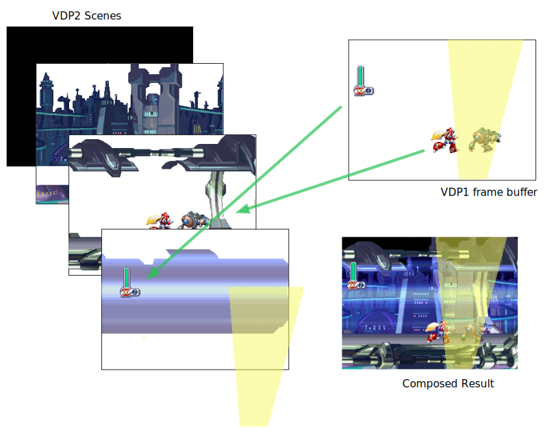

import { Article } from '../../../components/layouts/Article'

export const title = 'The Sega Saturn and Transparency';
export const date = new Date('2016-01-23');
export const type = 'interactive article';
export default ({ children }) => <Article title={title} date={date}>{children}</Article>

The Sega Saturn is notorious for not being able to pull off transparency effects as well as its competitors. But the Saturn does do proper transparency effects as many games demonstrate. So why did so many developers so often settle on the "mesh" approach in their Saturn games?

*This article is based on a YouTube video made by Low Score Boy. See the <a href="#and-thanks-to-low-score-boy">thank you section</a> at the bottom of this post.*

## The problem

Often Saturn games want to do a transparency effect but instead settle for a mesh approach.

Here in the beginning of Mega Man X4, the spotlights in the Saturn version are a mesh.

But they are truly transparent on the PlayStation.

<pitfall>
  Notice the Saturn is missing the second orange spotlight? It comes through fine on the PlayStation. It's technically there on the Saturn too (you can just see the beginnings of it) but the mesh approach does not allow it to display.
</pitfall>

And if you just walk forward a little bit, you find your character encased in a transparent glass tube, showing transparency works just fine on the Saturn!

So what's up with the spotlights?

## A Tale of Two Processors

Of the Saturn's 8 processors, 2 are dedicated to drawing graphics onto the screen, the VDP1 and the VDP2.

### The VDP1

The VDP1 is responsible for "highly dynamic" graphics. It is capable of drawing sprites and polygons into a frame buffer. The VDP1 has access to two frame buffers, it builds the next frame of the game in one buffer while the other one is being displayed.

To use the VDP1, you send it commands, which are 32 byte chunks of data that tell the VDP1 what to do. Of the many commands it understands, several are for drawing sprites and polygons. As far as the VDP1 is concerned, a sprite is really just a textured polygon. Both 2D and 3D games use the same command primitives to build up their scenes on the Saturn.

When sending a sprite draw command to the VDP1, you can tell it that sprite's pixels should be fully opaque, half-transparent or a mesh (along with some other options that I'm glossing over).

<wisdom>
Whenever you see a "mesh" in a Sega Saturn game, the VDP1 was responsible. The developers didn't have to create a second meshed version of the sprite, they just added the mesh flag to the command and the VDP1 responds by adding every other pixel into its buffer.
</wisdom>

### The VDP2

The VDP2 is responsible for managing 5 background layers (they are officially called "scenes", but I will use the term "layer" as I think it's clearer). It also has the job of taking the VDP1's frame buffer and incorporating it into the final image, in a sense the frame buffer is a sixth layer. But much more on that later.

The background layers can be stacked in any order, scrolled independently, some can be rotated and scaled, and some can be scaled on the z-axis accomplishing "mode 7" a la the Super Nintendo.

## Bringing VDP1 and VDP2 together

When it comes time to compose all of the layers together into an image to display on the screen, priority is used to decide on order. Each VDP2 layer has a priority set, and *each sprite in the VDP1 frame buffer also has a priority.* This allows different sprites to end up behind and in front of different layers.

<wisdom>
Technically the priority in the VDP1 frame buffer is per pixel, not per sprite. The VDP2 doesn't know of or care about sprites, it only sees pixels.
</wisdom>

When the VDP2 is composing all the layers together, it's also taking transparency into account. If a pixel in a higher priority layer is set to half-transparent, the final pixel will be the result of averaging the pixels from both layers together.

## The VDP1's frame buffer is only one "layer"

Here's the rub. When adding sprites to the frame buffer, at the end of the day they all come together into one pile of pixels. It's as if all the sprites join forces to become a single VDP2 layer. The VDP2 can only do transparency effects across layers. The Saturn is not capable of handling transparency effects between sprites.

If two sprites in the frame buffer overlap each other and both are opaque, then no big deal, the second sprite's pixel data replaces the first sprite's data in the buffer.

But if the second sprite wants to be half-transparent, it will still occupy that section of the buffer and clobber the previous sprite, but the data now sports a transparency flag.

Here in Guardian Heroes, Nicole's cape is translucent, it's a sprite that has been set to half-transparent.

But when she overlaps with another sprite, her cape "swallows" that sprite's data, still showing through to the background scene and not the sprite underneath. That's because the sprite data underneath no longer exists, instead Nicole's cape replaced it.

<wisdom>
In other words, every pixel in the VDP1 frame buffer can have a corresponding priority and transparency value. But at the end of the day, there's still only one pixel to work with. Overlapping sprites clobber each other. The last sprite to be drawn wins.
</wisdom>

## Meshes to the "rescue"

The way the VDP1 and VDP2 interact with each other works great for the most part, allowing the creation of elaborate game scenes. But half-transparency of sprites is a major limitation. Sega addressed the problem by allowing the mesh flag. This allows a quasi transparency effect without blowing sprites away.

By setting the mesh flag, the VDP1 will only draw every other pixel of a sprite into its buffer, allowing the previous sprite data to still show through in the gaps. That is exactly what the spotlights are doing in Mega Man X4, and they do so so that the foreground spotlights don't swallow up Mega Man and the enemies.

### The TVs of the nineties

When the Saturn was a current console, most people were hooking it up to their TV using composite cables. Composite is a low quality signal that combines all of the color information into a single blurry stream. This meant the mesh effect was not as noticeable, as the mesh pixels would tend to average out in the blurriness and result in a decent approximation of transparency. Complaints of the Saturn's meshes really started to rise when emulation and use of upscalers like the XRGB Mini enabled people to play Saturn games with a crystal clear picture.

Here is Mega Man X4 running via composite into my HDTV (oh the humanity...)

Not a perfect simulation of a typical 90s TV, but the best I can do :)

## A VDP1/VDP2 Simulator

Below is a simple simulator that shows how the VDP2 combines all the information into a final image on the screen. The spotlight in front is the most interesting thing here, when you play with its mesh and transparency settings, notice what happens to the other sprites behind it.

<link rel="stylesheet" href="simplegrid.css" />
<link rel="stylesheet" href="dist/bundle.css" />
<link rel="stylesheet" href="css/font-awesome.min.css" />

## And thanks to Low Score Boy

A big thank you to Low Score Boy on YouTube. His [video on this very subject](https://www.youtube.com/watch?v=f_OchOV_WDg) was an inspiration and source of lots of information for this blog post. I asked him if I could write a blog post based on his video. His video is highly recommended, he goes into more examples, shows how some developers worked around the limitations of the hardware and dives into 3D rendering too.
